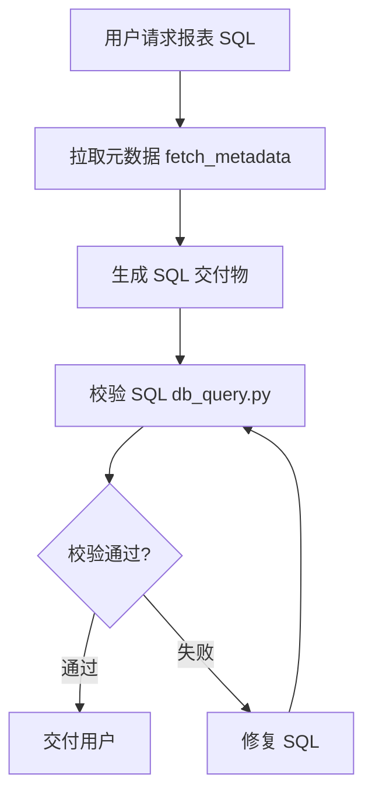

# 旗舰版报表 SQL 生成（iuap-c-report-sqlgen）

> **快速索引**：本文档 → [GUIDE.md](GUIDE.md) 深度指南

## 技能标识

**`iuap-c-report-sqlgen`** — 请与目录名保持一致。

## SQL 校验（硬性门禁）

**必须**在 `database.enabled: true` 时，对交付物执行：

```bash
cd skills/iuap-c-report-sqlgen/scripts
# --config 默认指向 ../config.yaml，--env-file 默认指向 ../.env，均可省略
python db_query.py --sql-file <交付物路径>
```

禁止在仅完成元数据拉取、未写交付物 SQL 的情况下宣称「已完成」。

| 条件 | 行为 |
|------|------|
| `database.enabled: true` | **必须**执行 `--sql-file` |
| `database.enabled: false` | 不得声称已校验 |

## 何时使用

- 需要根据**业务对象元数据**生成标准报表 SQL
- 用户提到 `SQL`、`报表`、`旗舰版通用_后端_报表_SQL生成`

## 工作流



### 1. 拉取元数据

```bash
cd skills/iuap-c-report-sqlgen/scripts

# 推荐方式：自动管理虚拟环境（首次自动安装依赖，后续静默跳过）
# --config 和 --env-file 均有默认值，通常可省略
./pip_install.sh run fetch_metadata.py --allbillname "销售订单"

# Windows：pip_install.cmd 与上式等价
# pip_install.cmd run fetch_metadata.py --allbillname "销售订单"
```

### 2. 生成 SQL

阅读 `output/report_sql_context.md`，按 `reference/旗舰版通用_后端_报表_SQL生成.md` 规则生成。

### 3. 交付物分文件

| 文件 | 内容 |
|------|------|
| `{报表名}.sql` | 仅 SQL，无 Markdown |
| `{报表名}_说明.md` | 说明文档，不内嵌完整 SQL |

### 4. SQL 校验

```bash
# 主校验（必做）
python db_query.py --sql-file <报表名>.sql

# 指定 .env 路径（.env 不在默认位置时使用）
python db_query.py --env-file /path/to/.env --sql-file <报表名>.sql

# 补充校验（可选）
python db_query.py --sql-file <报表名>.sql --query elastic_field_check
```

## 配置

编辑 [config.yaml](config.yaml)，关键段：

- `api` — 开放平台认证与元数据接口
- `request` — 请求参数（`allbillname` 必填，或与 `queryUri` 二选一以按 uri 直查；`metadata_lookup.json` 中同一 `bizName` 多 uri 时脚本会返回 `selection`，选定后设 `queryUri` 重试，见 [GUIDE.md](GUIDE.md)）
- `paths` — `workspace_root` 为项目根（输出目录）
- `database` — 数据库连接（强烈建议启用）
- `rate_limit` — 限流配置（防止网关限流）
- `cache` — 缓存配置（URI 等数据缓存）
- `logging` — 日志配置
- `environment` — 环境区分（dev/staging/prod）

### 环境变量支持

支持 `${VAR_NAME}` 和 `${VAR_NAME:-default}` 语法：

```yaml
api:
  base_url: "${API_BASE_URL:-https://c1pocpro.yonyoucloud.com/}"
  app_secret: "${API_APP_SECRET}"  # 必须通过环境变量设置
  app_key: "${API_APP_KEY:-69908642bca7453f94b3fd964d476926}"

database:
  host: "${DB_HOST:-192.168.19.151}"
  password: "${DB_PASSWORD}"

environment:
  name: "${ENV_NAME:-development}"
  debug: "${ENV_DEBUG:-false}"
```

常用环境变量：

| 变量 | 说明 | 默认值 |
|------|------|--------|
| `API_BASE_URL` | 开放平台地址 | `https://c1pocpro.yonyoucloud.com/` |
| `API_APP_KEY` | 应用 Key | 配置文件中指定 |
| `API_APP_SECRET` | 应用密钥（敏感） | - |
| `YONBIP_TENANT_ID` | 租户 ID | `q6shbpxc` |
| `DB_ENABLED` | 是否启用数据库校验 | `true` |
| `DB_DRIVER` | 数据库类型 | `mysql` |
| `DB_HOST` | 数据库地址 | `192.168.19.151` |
| `DB_PORT` | 数据库端口 | `3306` |
| `DB_USER` | 数据库用户 | `kk1mysql_linshi` |
| `DB_PASSWORD` | 数据库密码（敏感） | - |
| `DB_NAME` | 库名/逻辑库：MySQL、PostgreSQL、SQL Server 必填；Oracle 可忽略；达梦**可选**（不填则连默认实例，或填实例/模式名） | `crm` |
| `DB_CHARSET` | 字符集 | `utf8mb4` |
| `DB_SERVICE_NAME` | **Oracle 专用**服务名，与 `DB_NAME` 无关 | `ORCL` |
| `LOG_LEVEL` | 日志级别 | `INFO` |
| `ENV_NAME` | 环境名称 | `development` |
| `ENV_DEBUG` | 调试模式 | `false` |

### 数据库驱动配置

支持以下数据库驱动：

| 驱动值 | 数据库类型 | 默认端口 | 需要的包 |
|--------|-----------|----------|----------|
| `mysql` | MySQL | 3306 | `pymysql>=1.1.0` |
| `postgresql` / `postgres` / `pg` | PostgreSQL | 5432 | `psycopg2-binary>=2.9.9` |
| `oracle` / `cx_oracle` | Oracle | 1521 | `cx-Oracle>=8.3.0` |
| `dm` / `dmdb` / `dameng` | 达梦数据库 | 5236 | `dmPython>=1.2.0` |
| `mssql` / `sqlserver` / `sql_server` | SQL Server | 1433 | `pymssql>=2.2.0` |

#### 达梦数据库配置示例

`database`（对应 `DB_NAME`）**可省略**；需指定实例/模式时填写。未填时脚本以 `host:port` 连接默认库。

```yaml
database:
  enabled: true
  driver: "dm"  # 或 "dmdb" / "dameng"
  host: "${DM_HOST:-192.168.1.100}"
  port: 5236    # 达梦默认端口
  user: "${DM_USER:-SYSDBA}"
  password: "${DM_PASSWORD}"
  # 可选，例如实例名/模式
  # database: "${DM_DATABASE:-DAMENG}"
  charset: "utf8"
```

#### SQL Server 配置示例

```yaml
database:
  enabled: true
  driver: "mssql"  # 或 "sqlserver" / "sql_server"
  host: "${MSSQL_HOST:-192.168.1.100}"
  port: 1433        # SQL Server默认端口
  user: "${MSSQL_USER:-sa}"
  password: "${MSSQL_PASSWORD}"
  database: "${MSSQL_DATABASE:-master}"
  charset: "utf8"
```

### 限流配置

```yaml
rate_limit:
  enabled: true
  requests_per_second: 10.0  # 每秒请求数
  burst_capacity: 20.0        # 突发容量
```

### 环境区分

```yaml
environment:
  name: "${ENV_NAME:-development}"  # development / staging / production
  debug: "${ENV_DEBUG:-false}"
```

## 话术 → request 映射

### allbillname 业务对象识别规则

业务对象名称通常包含以下结构化后缀，AI 应能根据用户话术中的关键词匹配正确的 `allbillname`：

| 识别模式 | 话术关键词 | 典型取值 |
|----------|-----------|----------|
| **单据主表/表头** | 「销售订单」「采购订单」「发货单」 | `销售订单`, `采购订单表头`, `发货单主表` |
| **单据明细/子表** | 「明细」「详情」「分录」 | `销售订单明细`, `发货单详情`, `单据分录表` |
| **自定义项** | 「自定义项」 | `销售订单自定义项`, `单据子表自定义项` |
| **自定义特征** | 「自由项」「特征」 | `物料自由项特征`, `计划项目自定义特征` |
| **变更单** | 「变更」 | `销售订单变更`, `合同变更单据表`, `状态变更单表` |
| **历史库** | 「历史」 | `优质优价历史库表头`, `业务变更历史` |
| **申请单** | 「申请」 | `要货申请`, `退租申请`, `出口退税申请单` |
| **确认单** | 「确认」 | `应收确认规则`, `收入确认单`, `入库确认` |
| **调整单** | 「调整」 | `销售成本结转调整`, `信用调整单`, `资产调整事项` |
| **计划单** | 「计划」 | `资金计划编制单`, `LRP计划运行`, `目标库存计划` |
| **台账** | 「台账」 | `固定资产台账`, `金融融资台账`, `支出台账` |
| **报表** | 「报表」 | `渠道统计日报表`, `国资委报表` |
| **看板** | 「看板」 | `费用预算看板`, `服务运营看板` |
| **汇总** | 「汇总」 | `销售汇总表`, `年末汇兑损益汇总预测` |
| **关联关系** | 「关联」「关系」 | `供应商关系管理配置`, `分包管理关联合同表` |

### 其他配置项

| 配置项 | 话术示例 | 典型取值 |
|--------|----------|----------|
| `isIncludeSub` | 「含子表、所有、详情」→ Y | `Y` / `N` |
| `docFields` | 「只要单据编号、客户」 | `单据编号,客户` |
| `isSQL` | 「要 JOIN 参照表」→ Y | `Y` / `N` |

## 脚本速查

| 脚本 | 用途 |
|------|------|
| `fetch_metadata.py` | 拉取元数据 |
| `db_query.py` | SQL 校验 |
| `scaffold_report_deliverable.py` | 生成交付物骨架 |
| `metadata_parse.py` | 元数据解析 |
| `bip_auth.py` | 认证与 Token |

## 禁止事项

- ❌ 禁止在技能目录内生成交付物
- ❌ 禁止仅凭 `--run-db-check` 替代交付物校验
- ❌ 禁止将 SQL 与说明混在一个文件
- ❌ `database.enabled: false` 时不得声称已校验

## 相关文档

- [GUIDE.md](GUIDE.md) — 深度配置与故障排查指南
- [reference/旗舰版通用_后端_报表_SQL生成.md](reference/旗舰版通用_后端_报表_SQL生成.md) — SQL 规则
- [reference/报表说明文档模板.md](reference/报表说明文档模板.md) — 说明文档模板
